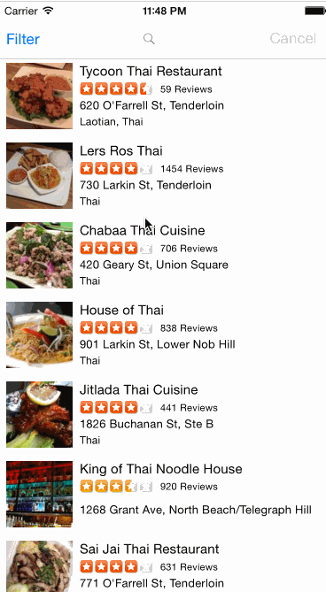

## Yelp

This is a Yelp search app using the [Yelp API](https://www.yelp.com/developers/documentation).

Time spent: `8`

### Features

#### Required

- [x] Search results page
- [x] Table rows should be dynamic height according to the content height
- [x] Custom cells should have the proper Auto Layout constraints
- [x] Search bar should be in the navigation bar (doesn't have to expand to show location like the real Yelp app does).
- [x] Filter page. Unfortunately, not all the filters are supported in the Yelp API.

I wasn't able to finish the protocol part, so I'm going to turn this in for now. But I will continue to work on this throughout the night.
- [x] The filters you should actually have are: category, sort (best match, distance, highest rated), radius (meters), deals (on/off).
- [x] The filters table should be organized into sections as in the mock.
- [ ] Clicking on the "Search" button should dismiss the filters page and trigger the search w/ the new filter settings.
- [ ] Display some of the available Yelp categories (choose any 3-4 that you want).

#### Optional

- [ ] Infinite scroll for restaurant results
- [ ] Implement map view of restaurant results
- [ ] Filter page
- [x] Radius filter should expand as in the real Yelp app
- [ ] Categories should show a subset of the full list with a "See All" row to expand. Category list is here: http://www.yelp.com/developers/documentation/category_list (Links to an external site.)
- [ ] Implement the restaurant detail page.

### Walkthrough

